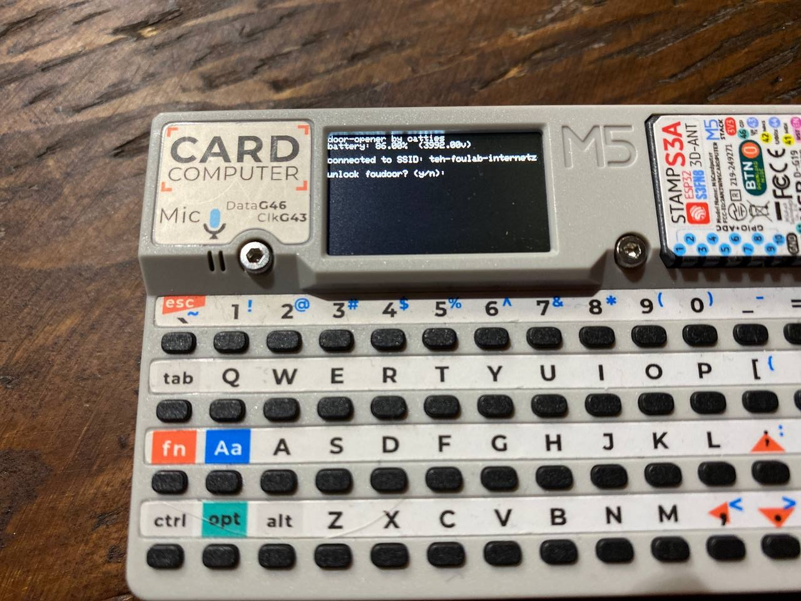

## Overview

- A door opener for foulab's foudoor.

## Prerequisites

- An M5Stack Cardputer.
- A microSD card formatted FAT32.
- WiFi credentials (SSID and password) for the network you want to connect to.
- SSH server credentials (hostname, username, and privkey) for the remote server you want to access.
